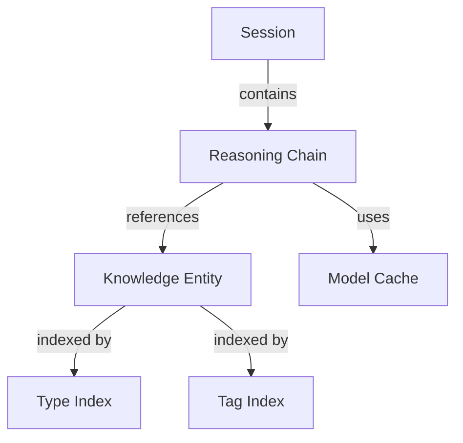

# Redis Database Schema Design
## MSA Reasoning Engine

### Overview
The Redis database serves as a high-performance caching and retrieval layer for the MSA Reasoning Engine, storing reasoning chains, knowledge entities, session data, and model results.

## Key Naming Conventions

### Pattern Structure
```
<namespace>:<type>:<identifier>
```

### Namespaces
- `reasoning_chain:` - Reasoning process chains
- `knowledge:` - Knowledge base entities
- `session:` - User session data
- `model_cache:` - Cached model results
- `knowledge_type:` - Type-based knowledge indexes
- `knowledge_tag:` - Tag-based knowledge indexes

## Data Structures

### 1. Reasoning Chains
**Key Pattern:** `reasoning_chain:<chain_id>`
**Type:** String (JSON)
**TTL:** 3600 seconds (default)
**Structure:**
```json
{
  "session_id": "string",
  "scenario": "string",
  "mode1_output": {
    "entities": [],
    "relationships": [],
    "causal_factors": []
  },
  "mode2_output": {
    "model": "string",
    "predictions": {},
    "confidence": "float"
  },
  "reasoning_steps": [],
  "timestamp": "ISO 8601",
  "metadata": {}
}
```

### 2. Knowledge Entities
**Key Pattern:** `knowledge:<type>:<id>`
**Type:** String (JSON)
**TTL:** 86400 seconds (24 hours)
**Structure:**
```json
{
  "name": "string",
  "description": "string",
  "domain": "string",
  "properties": {},
  "_type": "string",
  "_tags": ["array", "of", "strings"],
  "_timestamp": "ISO 8601"
}
```

### 3. Session Management
**Key Pattern:** `session:<session_id>`
**Type:** String (JSON)
**TTL:** 7200 seconds (2 hours)
**Structure:**
```json
{
  "metadata": {
    "user": "string",
    "purpose": "string",
    "context": {}
  },
  "created_at": "ISO 8601",
  "last_accessed": "ISO 8601",
  "reasoning_chains": ["array", "of", "chain_ids"],
  "status": "active|completed|failed"
}
```

### 4. Model Cache
**Key Pattern:** `model_cache:<model_name>:<input_hash>`
**Type:** String (JSON)
**TTL:** 1800 seconds (30 minutes)
**Structure:**
```json
{
  "input": {},
  "output": {},
  "model_version": "string",
  "inference_time_ms": "float",
  "cached_at": "ISO 8601"
}
```

## Indexes and Sets

### 1. Reasoning Chain Index
**Key:** `reasoning_chains`
**Type:** Set
**Members:** All reasoning chain IDs
**Purpose:** Quick listing of all chains

### 2. Knowledge Type Index
**Key Pattern:** `knowledge_type:<type>`
**Type:** Set
**Members:** Knowledge IDs of that type
**Example:** `knowledge_type:concept` → {`bayesian_inference`, `neural_network`, ...}

### 3. Knowledge Tag Index
**Key Pattern:** `knowledge_tag:<tag>`
**Type:** Set
**Members:** Knowledge references (`<type>:<id>`)
**Example:** `knowledge_tag:statistics` → {`concept:bayesian_inference`, ...}

### 4. Session Index
**Key:** `active_sessions`
**Type:** Set
**Members:** Active session IDs
**TTL:** Auto-managed based on session activity

## Data Relationships



## TTL Strategy

| Data Type | Default TTL | Rationale |
|-----------|-------------|-----------|
| Reasoning Chains | 1 hour | Recent chains for quick retrieval |
| Knowledge Entities | 24 hours | Stable knowledge, longer retention |
| Sessions | 2 hours | Active session tracking |
| Model Cache | 30 minutes | Quick re-computation availability |
| Search Results | 5 minutes | Very short-term caching |

## Access Patterns

### 1. Store Reasoning Chain
```
1. SETEX reasoning_chain:<id> <ttl> <json_data>
2. SADD reasoning_chains <id>
3. SADD session:<session_id>:chains <id>
```

### 2. Store Knowledge Entity
```
1. SETEX knowledge:<type>:<id> <ttl> <json_data>
2. SADD knowledge_type:<type> <id>
3. For each tag: SADD knowledge_tag:<tag> <type>:<id>
```

### 3. Retrieve by Type
```
1. SMEMBERS knowledge_type:<type>
2. For each member: GET knowledge:<type>:<member>
```

### 4. Semantic Search (Pattern)
```
1. SCAN 0 MATCH knowledge:* COUNT 100
2. For each key: GET <key> and check relevance
3. Score and rank results
```

## Memory Optimization

### Strategies
1. **JSON Compression**: Store large JSON objects compressed
2. **Field Extraction**: Store frequently accessed fields separately
3. **Pagination**: Use SCAN instead of KEYS for large datasets
4. **Pipeline Operations**: Batch multiple operations
5. **Lazy Deletion**: Use UNLINK instead of DEL for large keys

### Memory Limits
- Max key size: 512 MB
- Max set members: 4 billion
- Recommended JSON size: < 1 MB per key

## Backup and Recovery

### Backup Strategy
- Use Redis persistence (RDB + AOF)
- Regular snapshots to cloud storage
- Export critical data to persistent storage

### Recovery Process
1. Restore from latest RDB snapshot
2. Replay AOF log for recent changes
3. Validate data integrity
4. Rebuild indexes if necessary

## Performance Considerations

### Read Optimization
- Use pipelining for multiple reads
- Cache frequently accessed data in application memory
- Use Redis read replicas for scaling

### Write Optimization
- Batch writes when possible
- Use async operations
- Implement write-through caching

### Monitoring Metrics
- Memory usage percentage
- Hit/miss ratio
- Average response time
- Number of active connections
- Eviction rate

## Security Considerations

1. **Authentication**: Redis password required
2. **Encryption**: TLS for data in transit
3. **Access Control**: Limit commands via ACL
4. **Network Security**: Firewall rules for Redis port
5. **Data Sanitization**: Validate all inputs before storage

## Future Enhancements

1. **Graph Relationships**: Use Redis Graph for complex entity relationships
2. **Time Series**: Add Redis TimeSeries for performance metrics
3. **Full-Text Search**: Implement RediSearch for better semantic search
4. **Streams**: Use Redis Streams for event-driven updates
5. **Geo-Spatial**: Add location-based knowledge indexing