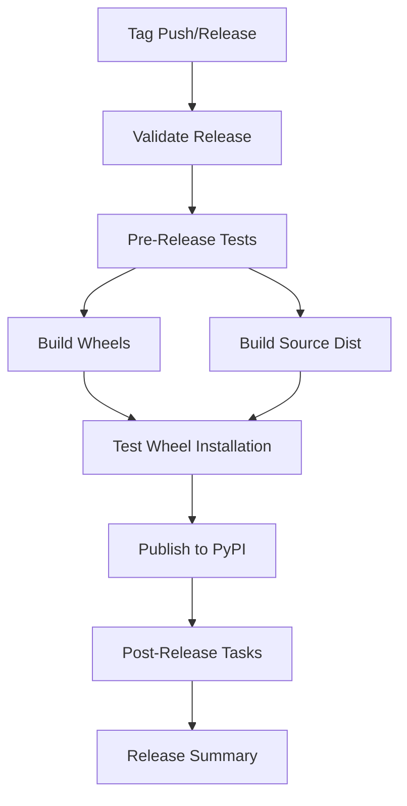

# Automated Release Pipeline

This repository uses a comprehensive automated release pipeline that handles version management, testing, building, and publishing to PyPI. The pipeline ensures high-quality releases through extensive validation and testing.

## 🚀 Quick Release Guide

### Method 1: Using the Release Script (Recommended)

```bash
# 1. Bump version and commit
python scripts/release.py bump patch  # or minor/major

# 2. Create and push release tag
python scripts/release.py release 1.0.1

# 3. The GitHub Actions pipeline will automatically:
#    - Run comprehensive tests
#    - Build wheels for all platforms
#    - Test wheel installation
#    - Publish to PyPI
#    - Create GitHub release with changelog
```

### Method 2: Manual Tag Creation

```bash
# 1. Update version in pyproject.toml and Cargo.toml
# 2. Commit changes
git add pyproject.toml Cargo.toml
git commit -m "Bump version to 1.0.1"

# 3. Create and push tag
git tag -a v1.0.1 -m "Release v1.0.1"
git push origin v1.0.1
```

### Method 3: GitHub Release UI

1. Go to GitHub repository → Releases → "Create a new release"
2. Create new tag (e.g., `v1.0.1`)
3. Fill in release title and description
4. Click "Publish release"

## 🔧 Pipeline Architecture

The automated release pipeline consists of multiple stages:



### Pipeline Stages

1. **Validate Release**
   - Extract version from tag
   - Check version consistency across files
   - Determine if prerelease

2. **Pre-Release Tests** (can be skipped for emergency releases)
   - Code quality checks (formatting, linting, type checking)
   - Rust and Python unit tests
   - Build verification

3. **Build Wheels**
   - Cross-platform wheel building (Linux, macOS, Windows)
   - Multiple architectures (x86_64, aarch64)
   - All supported Python versions (3.8-3.12)

4. **Build Source Distribution**
   - Create source distribution with maturin

5. **Test Wheel Installation**
   - Test wheel installation on multiple platforms
   - Verify import functionality

6. **Publish to PyPI**
   - Automatic environment selection (TEST for prereleases, PROD for stable)
   - Secure publishing with API tokens

7. **Post-Release Tasks**
   - Generate changelog from git commits
   - Update GitHub release with changelog
   - Create release for tag pushes

## 🛠️ Setup Instructions

### 1. Configure PyPI Environments

#### Production Environment (PROD)
1. Go to GitHub repository → Settings → Environments
2. Create environment named `PROD`
3. Add secret `PYPI_TOKEN` with your PyPI API token
4. Optional: Add protection rules (require reviewers)

#### Test Environment (TEST) - Optional
1. Create environment named `TEST`
2. Add secret `TEST_PYPI_TOKEN` with Test PyPI API token
3. Used automatically for prerelease versions

### 2. PyPI API Token Setup

#### For Production PyPI:
1. Go to [PyPI](https://pypi.org) → Account Settings → API tokens
2. Create token scoped to `requestx` project
3. Copy token (starts with `pypi-`)
4. Add as `PYPI_TOKEN` secret in `PROD` environment

#### For Test PyPI (Optional):
1. Go to [Test PyPI](https://test.pypi.org) → Account Settings → API tokens
2. Create token scoped to `requestx` project
3. Add as `TEST_PYPI_TOKEN` secret in `TEST` environment

## 📋 Release Management Scripts

### Release Script (`scripts/release.py`)

```bash
# Show current version
python scripts/release.py version

# Bump version (creates commit)
python scripts/release.py bump patch|minor|major

# Generate changelog
python scripts/release.py changelog 1.0.1

# Create release (creates and pushes tag)
python scripts/release.py release 1.0.1

# Dry run (show what would happen)
python scripts/release.py release 1.0.1 --dry-run
```

### Test Release Script (`scripts/test_release.py`)

```bash
# Test complete release workflow
python scripts/test_release.py

# Test specific component
python scripts/test_release.py --test wheel

# Output results as JSON
python scripts/test_release.py --json
```

## 🧪 Testing the Release Pipeline

Before making your first release, test the pipeline:

```bash
# 1. Test all components
python scripts/test_release.py

# 2. Test wheel building specifically
python scripts/test_release.py --test wheel

# 3. Test with a prerelease version
python scripts/release.py release 1.0.0-alpha.1
```

## 📦 Supported Platforms and Versions

### Platforms
- **Linux**: x86_64, aarch64 (glibc and musl)
- **macOS**: x86_64, aarch64 (universal2 wheels)
- **Windows**: x86_64, aarch64

### Python Versions
- Python 3.8, 3.9, 3.10, 3.11, 3.12
- Uses abi3 stable ABI for forward compatibility

## 🔄 Version Management

### Semantic Versioning
- **Major** (1.0.0): Breaking changes
- **Minor** (0.2.0): New features, backward compatible
- **Patch** (0.0.1): Bug fixes, backward compatible

### Prerelease Versions
- **Alpha**: `1.0.0-alpha.1` (early development)
- **Beta**: `1.0.0-beta.1` (feature complete, testing)
- **Release Candidate**: `1.0.0-rc.1` (final testing)

Prerelease versions automatically publish to Test PyPI.

## 📝 Changelog Generation

Changelogs are automatically generated from git commits:

```markdown
## Version 1.0.1

### Changes since v1.0.0

- Fix memory leak in response handling (a1b2c3d)
- Add support for custom headers (d4e5f6g)
- Update dependencies (g7h8i9j)

### Installation

```bash
pip install requestx==1.0.1
```
```

## 🚨 Emergency Releases

For urgent fixes that need to skip comprehensive testing:

```bash
# Manual workflow dispatch with skip_tests=true
# Go to Actions → "Automated Release Pipeline" → "Run workflow"
# Check "Skip comprehensive testing"
```

## 🔍 Monitoring and Troubleshooting

### Pipeline Status
- Monitor releases at: GitHub → Actions → "Automated Release Pipeline"
- Check PyPI uploads at: https://pypi.org/project/requestx/

### Common Issues

1. **Version Mismatch**
   ```
   ❌ Version mismatch: pyproject.toml (1.0.0) != tag (1.0.1)
   ```
   **Solution**: Update version in both `pyproject.toml` and `Cargo.toml`

2. **Authentication Error**
   ```
   ❌ Publishing failed: Invalid credentials
   ```
   **Solution**: Check `PYPI_TOKEN` secret in correct environment

3. **Wheel Building Failed**
   ```
   ❌ Wheel building failed on platform
   ```
   **Solution**: Check Rust compilation errors in logs

4. **Test Failures**
   ```
   ❌ Pre-release tests failed
   ```
   **Solution**: Fix failing tests or use emergency release for urgent fixes

### Getting Help

- **GitHub Actions Logs**: Detailed error messages and build logs
- **PyPI Status**: Check [PyPI status page](https://status.python.org/)
- **Maturin Docs**: [Building Python extensions](https://maturin.rs/)
- **PyPI Trusted Publishing**: [Official documentation](https://docs.pypi.org/trusted-publishers/)

## 📊 Release Metrics

The pipeline tracks:
- Build times across platforms
- Test coverage and success rates
- Wheel sizes and compatibility
- Download statistics (via PyPI)

## 🔐 Security

- **Trusted Publishing**: Uses OpenID Connect, no long-lived tokens
- **Environment Protection**: Production releases can require approval
- **Audit Trail**: All releases logged in GitHub Actions
- **Dependency Scanning**: Automated security checks in CI

## 🎯 Best Practices

1. **Always test locally first**: Run `python scripts/test_release.py`
2. **Use semantic versioning**: Follow semver.org guidelines
3. **Write meaningful commit messages**: They become changelog entries
4. **Test prereleases**: Use alpha/beta versions for testing
5. **Monitor releases**: Check PyPI and GitHub after publishing
6. **Keep dependencies updated**: Regular security updates