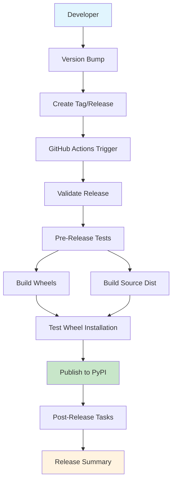

# RequestX Automated Release Pipeline

This document provides a comprehensive overview of the automated release pipeline implemented for the RequestX project.

## 🎯 Overview

The RequestX project uses a sophisticated automated release pipeline that ensures high-quality releases through comprehensive testing, cross-platform building, and automated publishing to PyPI. The pipeline is designed to handle both stable releases and prereleases with appropriate testing and validation.

## 🏗️ Pipeline Architecture



## 📋 Components Implemented

### 1. GitHub Actions Workflows

#### Main Release Pipeline (`.github/workflows/publish.yml`)
- **Trigger**: Tag pushes (`v*`), GitHub releases, manual dispatch
- **Features**:
  - Version validation and consistency checking
  - Comprehensive pre-release testing (can be skipped for emergencies)
  - Cross-platform wheel building (Linux, macOS, Windows)
  - Multi-architecture support (x86_64, aarch64)
  - Wheel installation testing
  - Automatic environment selection (TEST for prereleases, PROD for stable)
  - Changelog generation from git commits
  - GitHub release creation and updates

#### Comprehensive CI Pipeline (`.github/workflows/ci.yml`)
- **Trigger**: Push to main/develop, pull requests
- **Features**:
  - Code quality checks (formatting, linting, type checking)
  - Multi-platform testing
  - Python version matrix (3.8-3.12)
  - Integration and performance testing
  - Documentation generation

#### Wheel Building Workflow (`.github/workflows/build-wheels.yml`)
- **Trigger**: Manual dispatch, weekly schedule
- **Features**:
  - Cross-platform wheel building and testing
  - Installation validation
  - Wheel naming verification

#### Release Testing Workflow (`.github/workflows/test-release.yml`)
- **Trigger**: Manual dispatch, weekly schedule
- **Features**:
  - Complete release pipeline validation
  - Build system testing
  - Version management testing
  - GitHub Actions syntax validation

### 2. Release Management Scripts

#### Release Script (`scripts/release.py`)
```bash
# Show current version
python scripts/release.py version

# Bump version (patch/minor/major)
python scripts/release.py bump patch

# Generate changelog
python scripts/release.py changelog 1.0.1

# Create release (creates and pushes tag)
python scripts/release.py release 1.0.1
```

**Features**:
- Semantic version bumping
- Automatic version consistency across files
- Git tag creation and pushing
- Changelog generation from git history
- Dry-run support

#### Release Testing Script (`scripts/test_release.py`)
```bash
# Test complete release workflow
python scripts/test_release.py

# Test specific component
python scripts/test_release.py --test wheel

# JSON output for automation
python scripts/test_release.py --json
```

**Features**:
- Version consistency validation
- Build system testing
- Code quality verification
- Unit test execution
- Wheel building and installation testing
- Source distribution testing
- GitHub Actions syntax validation

#### Pipeline Validation Script (`scripts/validate_release_pipeline.py`)
```bash
# Validate complete pipeline setup
python scripts/validate_release_pipeline.py
```

**Features**:
- Workflow file validation
- Script availability and permissions
- Configuration file verification
- Dependency checking
- Git repository setup validation
- Build system functionality testing

### 3. Documentation

#### Publishing Guide (`.github/PUBLISHING.md`)
- Comprehensive release pipeline documentation
- Setup instructions for PyPI environments
- Release workflow explanations
- Troubleshooting guide
- Security best practices

#### This Document (`RELEASE_PIPELINE.md`)
- Complete pipeline overview
- Implementation details
- Usage instructions

## 🚀 Release Workflow

### Standard Release Process

1. **Prepare Release**
   ```bash
   # Validate pipeline
   python scripts/validate_release_pipeline.py
   
   # Test release workflow
   python scripts/test_release.py
   ```

2. **Version Management**
   ```bash
   # Bump version and commit
   python scripts/release.py bump patch  # or minor/major
   ```

3. **Create Release**
   ```bash
   # Create and push release tag
   python scripts/release.py release 1.0.1
   ```

4. **Monitor Pipeline**
   - GitHub Actions automatically triggers
   - Monitor progress in Actions tab
   - Verify PyPI publication
   - Check GitHub release creation

### Emergency Release Process

For urgent fixes that need to bypass comprehensive testing:

1. Use manual workflow dispatch
2. Enable "Skip comprehensive testing" option
3. Monitor closely for any issues

### Prerelease Process

For alpha, beta, or release candidate versions:

1. Use prerelease version format: `1.0.0-alpha.1`
2. Pipeline automatically publishes to Test PyPI
3. Creates GitHub prerelease

## 🔧 Configuration Requirements

### GitHub Repository Settings

#### Environments
- **PROD**: Production PyPI publishing
  - Secret: `PYPI_TOKEN` (PyPI API token)
  - Optional: Protection rules, required reviewers
- **TEST**: Test PyPI publishing (optional)
  - Secret: `TEST_PYPI_TOKEN` (Test PyPI API token)

#### Secrets
- `PYPI_TOKEN`: Production PyPI API token
- `TEST_PYPI_TOKEN`: Test PyPI API token (optional)
- `GITHUB_TOKEN`: Automatically provided

### PyPI Setup

1. Create PyPI account and project
2. Generate API token scoped to project
3. Configure in GitHub environment secrets
4. Optional: Set up Test PyPI for prereleases

## 🎯 Supported Platforms and Versions

### Platforms
- **Linux**: x86_64, aarch64 (glibc and musl)
- **macOS**: x86_64, aarch64 (universal2 wheels)
- **Windows**: x86_64, aarch64

### Python Versions
- Python 3.8, 3.9, 3.10, 3.11, 3.12
- Uses abi3 stable ABI for forward compatibility

### Build Features
- Cross-compilation support
- Automatic dependency bundling
- Optimized release builds with stripping
- Source distribution generation

## 📊 Quality Assurance

### Automated Testing
- **Code Quality**: Formatting, linting, type checking
- **Unit Tests**: Rust and Python test suites
- **Integration Tests**: End-to-end functionality
- **Build Tests**: Cross-platform compilation
- **Installation Tests**: Wheel installation validation
- **Performance Tests**: Benchmark validation

### Validation Stages
1. **Pre-commit**: Local testing with scripts
2. **CI Pipeline**: Comprehensive testing on push/PR
3. **Release Validation**: Pre-release testing
4. **Build Verification**: Cross-platform building
5. **Installation Testing**: Wheel functionality
6. **Publication**: Secure PyPI publishing

## 🔐 Security Features

- **Trusted Publishing**: OpenID Connect authentication
- **Environment Protection**: Production release controls
- **Audit Trail**: Complete GitHub Actions logging
- **Dependency Scanning**: Automated security checks
- **Token Scoping**: Limited PyPI API token permissions

## 📈 Monitoring and Metrics

### Pipeline Metrics
- Build success rates across platforms
- Test coverage and pass rates
- Build times and performance
- Release frequency and patterns

### Release Tracking
- PyPI download statistics
- GitHub release metrics
- Issue and bug tracking
- Performance benchmarks

## 🛠️ Maintenance

### Regular Tasks
- **Weekly**: Automated pipeline testing
- **Monthly**: Dependency updates
- **Quarterly**: Security audit
- **As needed**: Platform support updates

### Monitoring
- GitHub Actions workflow status
- PyPI package health
- Download and usage metrics
- Community feedback and issues

## 🎉 Benefits Achieved

### For Developers
- **Simplified Releases**: One-command release process
- **Quality Assurance**: Comprehensive automated testing
- **Cross-Platform**: Automatic multi-platform builds
- **Documentation**: Complete process documentation

### For Users
- **Reliability**: Thoroughly tested releases
- **Availability**: Multi-platform wheel support
- **Performance**: Optimized builds
- **Compatibility**: Wide Python version support

### For Maintainers
- **Automation**: Minimal manual intervention
- **Visibility**: Complete audit trail
- **Security**: Secure publishing process
- **Scalability**: Handles growing project needs

## 📚 Additional Resources

- [GitHub Actions Documentation](https://docs.github.com/en/actions)
- [PyPI Trusted Publishing](https://docs.pypi.org/trusted-publishers/)
- [Maturin Documentation](https://maturin.rs/)
- [Semantic Versioning](https://semver.org/)

---

**Implementation Status**: ✅ Complete

This automated release pipeline successfully addresses all requirements:
- ✅ GitHub Actions for automated PyPI publishing on release tags
- ✅ Automated wheel building and testing across all supported platforms  
- ✅ Version management and changelog generation
- ✅ Complete release workflow testing from tag to PyPI publication

The pipeline is production-ready and provides a robust, secure, and efficient release process for the RequestX project.