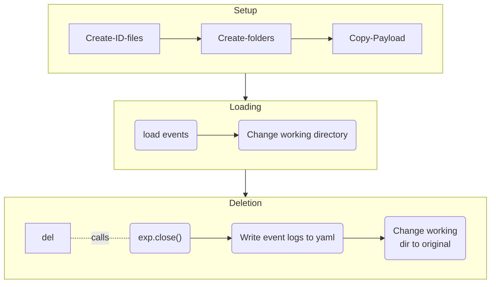
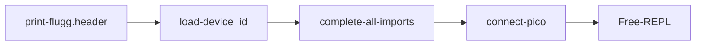
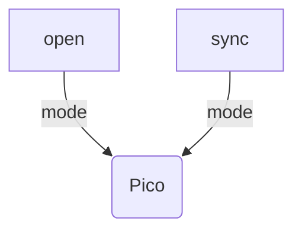
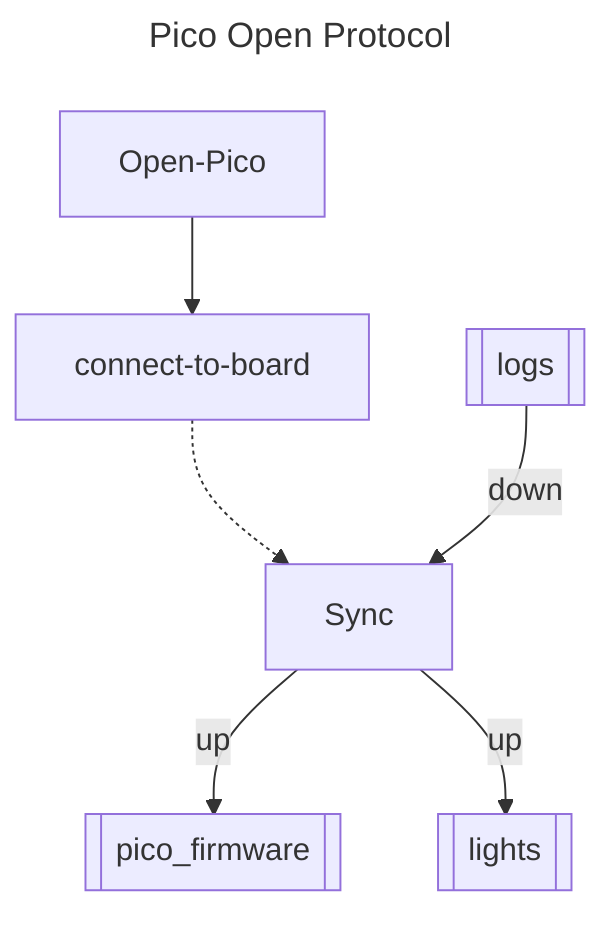

# scope-cli

Control Layer Interface for parallel microscopy system.


## Introduction

1. What is Trappy-Scopes?
2. How to use it?
3. Why you should use it?

## Installation

1. Install through conda or pip #todo

	```
	pip install trappyscopes
	conda install trappyscopes

2. You can install directly from the source and install the environment using the inbuilt installer that uses `pip`.

	```bash
	git clone -r <repo_link>
	cd <scope-cli>
	python main.py --install
	```

## Configure the Scope

1. 


## Get to know Trappy-Scope

1. Basic information about application startup
	```bash
	python main.py -h
	```

2. A little introduction can be summoned by calling `intro()`.

## Start-up and usage

+ Use `./trappyscope`, a typical startup would look like:
	```bash
	./trappyscope -su UserName experiment_script.py
	```

+ Start control layer utility with `python -i main.py` in the interactive mode. 

+ Scripts are an important part of running experimental procedures:
	```bash
	python main.py <script1> <script2> <script3>
	trappyscope <script1> <script2> <script3>
	python main.py --iterate 3 <script1> ## Run Script1 three times
	```

+ The scripts are executed in sequence and can be used to load pre-defined experimental protocols.

+ Alternatively, to load a script/execute a script from the interactive session:
	```bash
	ScriptEngine.now(globals(), "scriptfile.py")
	```


## Start an experiment

+ All data-collection should be done within the context of an `Experiment`:

  ```python
  exp = Experiment("test")
  ```

  You should get the following output:

  ```bash
  ────────────────────────────── Experiment open ─────────────────────────────────────────
  [17:21:08] INFO     Loading Experiment: test                                                                                                experiment.py:267
  Working directory changed to: /Users/byatharth/experiments/test
  .
  ├── .experiment
  ├── analysis
  ├── converted
  ├── experiment.yaml
  ├── postprocess
  └── sessions.yaml
  
  3 directories, 3 files
  
  user:ghost || ‹‹M1›› Experiment: test 
  >>>
  ```

The experiment features are described in the [expframework](expframework/README.md) submodule.

## Describing one scope

A `scope` is described as a tree of devices. It is a combination of Processors (`ProcessorGroup`), `Sensors` , and `Actuators`. A scope configuration is defined in the `deviceid.yaml` configuration file. An example is given below:

```yaml
name: MDev
uuid: null
type: microscope
frame:
- pico
- topplate
- lit
- diffuser
- lenses.asphere
- sample
- samplestage
- midplate
- zoomlens
- zoomlensholdplate
- camera
- baseplate
optics:
  lenses:
  - 120deg plastic asphere
  - ACL2520U
  - zoomlens
hardware:
  pico:
  - nullpico
  - pico1
  - nullpico
  camera: nullcamera
  illumination: CA_PWM_RGB_LED_5mm
git_sync: false
write_server: ssd1
file_server: smb://files1.igc.gulbenkian.pt/igc/folders/LP/yatharth
auto_fsync: false
auto_pico_fsync: true
```

## Describing N-scopes

Multiple scopes are defined by defining each of the configuration files on each of the scopes. After this is done, the network layer allows the scopes to be connected to the laboratory hive, where all scopes can be accessed on the fly.


## How to do Science on the scopes?

## An `Experiment`

The data and metadata collection for any experiment is handled through the `Experiment` class. It's primary role is to manage storage for every different experiments. Creation of the class, immediately changes the working directory to the experiment one. 

### Unique ID

Each experiment is also assigned a 10-digit hex unique id. Example: `e8423b83d2`. 

### File Structure

Each experiment has the following directory structure:

```
Experiment_name
		|- .experiment 			        (identifier)
		|- experiment.yaml          (event logs)
		|- data1, data2, data3, ... (data - in the repository)
		|- postprocess              (postprocessed data)
		|- converted                (online conversion - eg. between video formats)
		|- analysis                 (analysis results)
```

### Flow of Control - TODO check with the current version



### LoadScript utility TODO


### Configuration Files

1. `camconfig.yaml` : Contains the camera configuration file for the default mode.
2. `deviceid.yaml` : Contains the  unique identity constants for the device.
3. `common.py`  : Contains common constants for all devices.


###  TODO: Obsolete Current Sequence





### Hardware

The hardware is modelled as a device-tree or a hierarchical collection of devices. All nodes that are not end-nodes are turing complete computational devices.

```python
assembly: 
 | rpi: null
 | cam: camera
 | pico: 
 | | lit: light
 | | beacon: beacon
 | | tandh: t&h sensor
 | 
 *
```

## Hardware firmware

The hardware firmware is synched to the pico device in parts. 

**Pico Connection and FS Sync:**






### Device ID

Examplar Device ID file:

```yaml

```


The default mode for parsing a device ID structure is to first cast each field to a container/collection type and enforce the first value as the unique name and the 2nd value, if present, as a **Universal** unique identifier.


### Experiments

1. The `Experiment` class manages the saving of data in  specific folders and logs experiement events.
2. A folder qualifies as an Experiemnt if it contains the `.experiment` file with the UUID of the experiment.
3. The file `<Experiment_name>.yaml` contains the event logs of the experiments.


