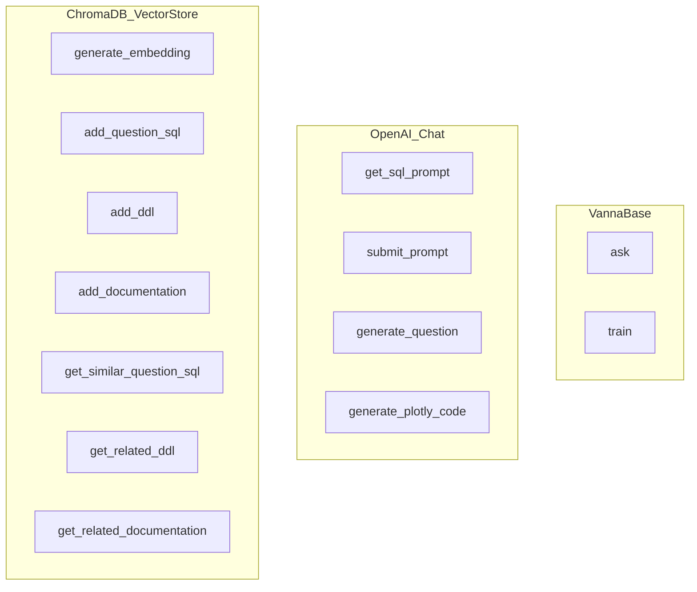

# Nomenclature

| Prefix | Definition | Examples |
| --- | --- | --- |
| Prefix        | Definition                                   | Examples                                                                                   |
| ---           | ---                                          | ---                                                                                        |
| `vn.get_`     | Fetch some data                              | [`vn.get_related_ddl(...)`][vanna.base.base.VannaBase.get_related_ddl]                     |
| `vn.add_`     | Adds something to the retrieval layer        | [`vn.add_question_sql(...)`][vanna.base.base.VannaBase.add_question_sql]                |
|               |                                              | [`vn.add_ddl(...)`][vanna.base.base.VannaBase.add_ddl]                                     |
| `vn.generate_`| Generates something using AI based on info   | [`vn.generate_sql(...)`][vanna.base.base.VannaBase.generate_sql]                        |
|               | in the model                                 | [`vn.generate_explanation()`][vanna.base.base.VannaBase.generate_explanation]              |
| `vn.run_`     | Runs code (SQL)                              | [`vn.run_sql`][vanna.base.base.VannaBase.run_sql]                                          |
| `vn.remove_`  | Removes something from the retrieval layer   | [`vn.remove_training_data`][vanna.base.base.VannaBase.remove_training_data]                |
| `vn.connect_` | Connects to a database                       | [`vn.connect_to_snowflake(...)`][vanna.base.base.VannaBase.connect_to_snowflake]           |
| `vn.update_`  | Updates something                            | N/A -- unused                                                                              |
| `vn.set_`     | Sets something                               | N/A -- unused                                                                              |

# Open-Source and Extending

Vanna.AI is open-source and extensible. 
If you'd like to use Vanna without the servers, see an example 
[here](https://vanna.ai/docs/postgres-ollama-chromadb/).

The following is an example of where various functions are implemented in the codebase 
when using the default "local" version of Vanna. 
`vanna.base.VannaBase` is the base class which provides a `vanna.base.VannaBase.ask` and 
`vanna.base.VannaBase.train` function. Those rely on abstract methods which are implemented 
in the subclasses `vanna.openai_chat.OpenAI_Chat` and `vanna.chromadb_vector.ChromaDB_VectorStore`. 
`vanna.openai_chat.OpenAI_Chat` uses the OpenAI API to generate SQL and Plotly code. 
`vanna.chromadb_vector.ChromaDB_VectorStore` uses ChromaDB to store training data and generate embeddings.

If you want to use Vanna with other LLMs or databases, 
you can create your own subclass of `vanna.base.VannaBase` and implement the abstract methods.

